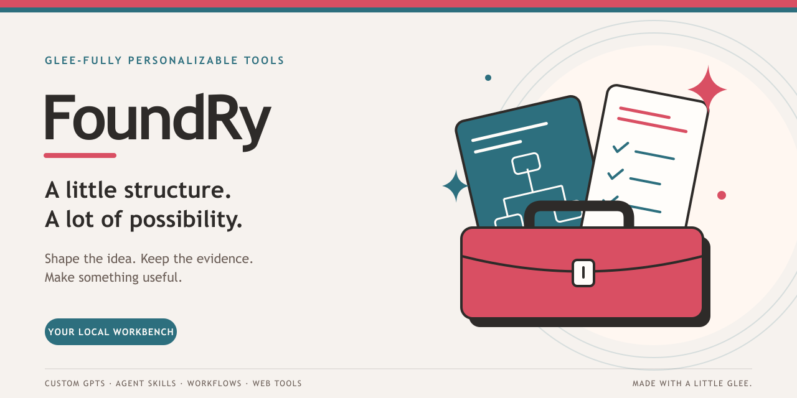

# Glee-fully Tools FoundRy

**A warm, practical workbench for turning a useful idea into a tool worth keeping.**



**[Open the local workbench](http://127.0.0.1:8765/)** · **[Start here](#run-it-locally)** · **[Explore Glee-fully Tools](https://glee-fully.tools/)**

The workbench link opens this application on your computer after startup. The public Glee-fully Tools site is the catalog and routing hub.

Make room for the next useful thing.

Glee-fully FoundRy brings the brief, building blocks, source references, acceptance evidence and export package into one owner-local workspace. Build a portable Agent Skill, compose a plugin or connector blueprint, or preserve a legacy GPT for conversion. Keep its history and leave with something another person can review and use.

Python 3.11+. A browser. No application dependencies to install, no build step, no model subscription required.

[Application guide](docs/application/README.md) · [Canon & source library](#canon-and-source-library) · [Visual identity](#visual-identity-and-sharing) · [Contributor guide](AGENTS.md)

## What you can make

| Start with | Leave with |
|---|---|
| **Agent Skill** | A portable skill specification with a bounded procedure and reviewable acceptance cases |
| **Plugin blueprint** | A skill composition and host adapter plan with explicit tools, permissions and verification requirements |
| **Connector blueprint** | An integration contract with operations, authentication scope names, error handling and recovery |
| **Legacy GPT source** | A preserved conversational tool specification to map into portable skills |
| **Workflow** | A repeatable process with responsibilities, decisions and completion checks |
| **Web tool** | An authored specification and a runnable record-management starter to adapt |

The web-tool starter supports adding, completing, reopening and filtering records. It is a starting implementation; authored requirements still need implementation and testing.

Plugin and connector exports are planning blueprints, with `installable: false`. Native packages and runtime compatibility require implementation and tests on each target host.

## Current product workflow

**Legacy GPT source -> portable skills -> skill composition -> tested host adapters.**

The app can derive a skill draft from a GPT source, then plugin or connector blueprints from a skill. Each derivation preserves its source revision and resets evaluation evidence. Use **Conversion & portability** to map source behavior, semantic loss, target hosts, tools and permissions. The portable core stays independent of a vendor account; host-specific packages are maintained separately.

Read the [portable capability workflow](docs/application/portable-capabilities.md) and [product subtree migration contract](products/README.md). Reviewed child projects can consolidate under `products/<capability-slug>/` while preserving provenance and private-source boundaries. This adaptation performs no child imports or remote cutovers. OverKill and AskJamie retain separate regional ownership.

## Inside the workbench

- **A brief with a purpose.** Capture the owner, version, audience, inputs, outputs, constraints and instructions in one place.
- **Pieces that fit together.** Define components and dependencies. Save checks the structure and rejects dependency cycles.
- **Evidence beside the claim.** Record expected and observed results. Material specification changes reset earlier evaluation results so old passes cannot silently certify new work.
- **References within reach.** Attach pinned Skillz references and read the allowlisted PromptChain, scaffold, PulseBook, vernacular and canon overview.
- **A package you can inspect.** Review generated files and the manifest before exporting Markdown, JSON or a ZIP package.
- **Room to revise.** Keep revision history, duplicate a project, archive and restore drafts, or back up and restore the whole workspace.

Day and night themes, keyboard focus and a responsive layout are part of the application. Working records persist in local SQLite across browser reloads and server restarts.

**Review-ready means ready for human review.** It does not register a canonical entity, grant PME approval or publish anything to an external platform.

## Run it locally

Clone the repository, then start the application from its root:

```bash
git clone https://github.com/OKHP3/glee-fullytools-foundry.git
cd glee-fullytools-foundry
python3 -m app.server
```

On Windows, use `py -3 -m app.server` if your Python launcher is `py`. Python 3.11 or newer is required.

Then **[open Glee-fully FoundRy](http://127.0.0.1:8765/)**. Stop the server with Ctrl+C.

### Your first useful package

1. Start with **Agent Skill**, or preserve an existing specification as **Legacy GPT source**. Plugin and connector blueprints, workflows and web tools are also available.
2. Give the project a name, owner, version and useful outcome.
3. Add components and acceptance cases, then save the specification.
4. Run your checks and record what actually happened.
5. Open **Review**, check readiness, inspect the package and export it.

See the [application guide](docs/application/README.md) for alternate ports, imports, revision conflicts and backup recovery. The [example packages](docs/application/pilots/) preserve the original four output types; the [portable workflow](docs/application/portable-capabilities.md) documents the added blueprints.

## Private work, public source

The source repository is intentionally public. Your project records belong on your computer.

The application binds only to loopback, stores private working data in the Git-ignored `.foundry-data/` folder, and serves only explicitly allowed application assets and reference files. It makes no outbound model requests and has no telemetry. Exports and backups can contain your authored private information; choose where to share them.

This is an owner-local application. Public or multiuser hosting requires a separate architecture and release decision. The repository root, `web-templates/` and private working data must never be served as a website.

Source visibility does not grant unrestricted reuse. [LICENSE.md](LICENSE.md) contains the proprietary terms; its historical private-repository label does not describe current GitHub visibility.

## Canon and source library

The application sits beside a preserved, governed library for Glee-fully Personalizable Tools™. Drafts and revision history live in SQLite. Canon stays in its ledgers, and promotion remains an explicit governed activity.

| Find your starting point | What lives there |
|---|---|
| [Canon](canon/README.md) | Nine authoritative ledgers covering registration, persona, parameters, system, hydration, narrative, ideation, archive and legacy processing |
| [Governance](governance/README.md) | The v3.0.1 directive, project instructions, Strategy Center instructions and Operator's Cathedral architecture |
| [Prompts](prompts/README.md) | Builder-Ready PromptChain v2.0, GPT scaffolds and website-content synthesis |
| [Templates](templates/README.md) | FrankenTemplate variants and hybrid instruction scaffolds |
| [Evaluation](evaluation/README.md) | GPT PulseBook; [v1.7](evaluation/gpt-pulsebook-evaluation-v1-7.md) is the current local rubric |
| [Vernacular](vernacular/README.md) | Complete and lite voice, tone and Glee-ism references |
| [Inventory](inventory/README.md) | [Entity catalog and recorded ChatGPT links](inventory/inventory-of-toolbox-tools-and-tool-ettes.md); external availability needs its own verification |
| [Product subtrees](products/README.md) | Reviewed consolidation contract and migration map for capability source, skills and host adapters |
| [Documentation](docs/README.md) | Narrative, technical and operating references, plus research and imported source material |
| [Agent Skills](.agents/skills/README.md) | Repository-local reusable methods and their provenance |
| [Snapshots](snapshots/README.md) | Read-only historical captures and lineage evidence |
| [Web templates](web-templates/README.md) | Source assets for child-repository landing pages, not pages served by this workbench |
| [Maintenance scripts](scripts/README.md) | Repository audits and utilities with documented scope and limitations |

### The Glee-fully family tree

The **Toolbox** routes to **Tools**, which hold **Tool-ettes**, supported by **Functions** and **Function-ettes**. The seven Tool branches give the collection its shape:

| Branch | Everyday purpose |
|---|---|
| Discovered Careers | Resumes, job searches and professional development |
| Treasured Finds | Books, wine, vintage finds and media collections |
| Tasty Tracker | Meal planning, recipes and grocery lists |
| Traveler's Guide | Trip planning, wish-boarding and itineraries |
| Organized Life | Personal dashboards, scheduling and productivity |
| Healthy Bee-ing | Wellness habits and lifestyle balance |
| Identity Known | Journaling, reflection and self-discovery |

The [Builder-Ready PromptChain](prompts/glee-fully-builder-ready-promptchain-v2-0.md) takes a GPT through PROMPT00 ignition, PROMPT01 ingestion, PROMPT02 visual identity, PROMPT03 registration, PROMPT04 team roles and PROMPT05 fusion review. The [PulseBook evaluation](evaluation/gpt-pulsebook-evaluation-v1-7.md) supports the governed PME-readiness decision. These are documented builder workflows, not automatic application actions or proof of external deployment.

Canonical content grows forward. Preserve CanonSeal tags, use the registry for clause IDs, and keep canonical continuity in the hydration ledger. Untagged work defaults to `GleeTone.A1`. [AGENTS.md](AGENTS.md) explains the full authority chain, suffix law and safe-change procedure.

## Part of a bigger, carefully separated universe

AskJamie sits to the left, Glee-fully to the right, and OverKill at the connective center. **Skillz is shared. Each region has its own FoundRy.**

| Neighbor | Connection |
|---|---|
| [Glee-fully Tools](https://glee-fully.tools/) | Public catalog and routing hub for this region |
| [OverKill Hill](https://overkillhill.com/) | Universe context, methodology and public research |
| [Skillz](https://okhp3.github.io/skillz/) | Shared portable Agent Skill catalog |
| [AskJamie](https://askjamie.bot/) · [AskJamie FoundRy](https://github.com/OKHP3/askjamie-foundry) | Interpretive experiences and their regional workbench |
| [OverKill Found-Ry](https://github.com/OKHP3/overkill-hill-foundry) | OverKill's own builder and a reciprocal mentoring pattern |

Mentoring travels in both directions. Runtime ownership, databases and private records stay distinct. The [seven-element research report](docs/research/okhp3-universe-2026-09-07/report.html) records the evidence and boundaries.

## Visual identity and sharing


Warm paper. Pink and teal. A toolbox with a little sparkle.

The cover and browser artwork share the Glee-fully palette and an original vector identity. All assets live in this repository, with no external image or font service required.

| Asset | Ready to use |
|---|---|
| Cover and social image | [1280 × 640 PNG](app/static/brand/social-preview.png) · [Editable SVG](app/static/brand/cover.svg) |
| Browser favicon | [SVG](app/static/brand/icon.svg) · [ICO](app/static/brand/favicon.ico) · [16 px](app/static/brand/favicon-16.png) · [32 px](app/static/brand/favicon-32.png) |
| Apple touch icon | [180 px PNG](app/static/brand/apple-touch-icon.png) |
| App shortcut icons | [192 px](app/static/brand/icon-192.png) · [512 px](app/static/brand/icon-512.png) · [Maskable 512 px](app/static/brand/icon-maskable-512.png) |
| Safari pinned tab | [Monochrome SVG](app/static/brand/safari-pinned-tab.svg) |
| Browser metadata | [HTML head](app/static/index.html) · [Web app manifest](app/static/site.webmanifest) |

The local application includes a description, theme color, icons and Open Graph / Twitter card metadata. Shortcuts still need the local server running; this does not add offline support or public hosting.

GitHub controls the repository page's metadata separately from the application. The cover is embedded here; to use it for GitHub repository link previews, upload the PNG under **Settings → General → Social preview**. See the [visual asset guide](app/static/brand/README.md) for provenance, dimensions and that final setup step.

## Working on the FoundRy

Start with [AGENTS.md](AGENTS.md). Use the [collaboration protocol](docs/agent-collaboration.md) for work across Codex, Replit, Claude and GitHub Copilot, with clear ownership, compact handoffs and validation evidence.

Useful checks from the repository root:

```bash
python3 -m unittest discover -s app/tests -v
python3 scripts/check-markdown-links.py .
python3 -m py_compile app/server.py
node --check app/static/app.js
git diff --check
```

Node is used for the optional JavaScript syntax check; it is not an application runtime requirement. Maintenance validators have their own dependencies in `requirements.txt`. Legacy audit assumptions are documented in [AGENTS.md](AGENTS.md) and are separate from application health checks.

[Application verification](docs/application/verification.md) · [Portable capability verification](docs/application/portable-capability-verification.md) · [Current state & roadmap](docs/application/current-state-and-maturation.md) · [Technology inventory](docs/technology-inventory.md) · [Changelog](CHANGELOG.md) · [Manifest](manifest.yaml) · [License](LICENSE.md)

**Glee:** the muse behind the warmth, color and useful little details.

**Jamie Hill:** creator and maintainer, [OverKill Hill P³](https://overkillhill.com/).

---

*The capability is durable. The platform wrapper is temporary.*
